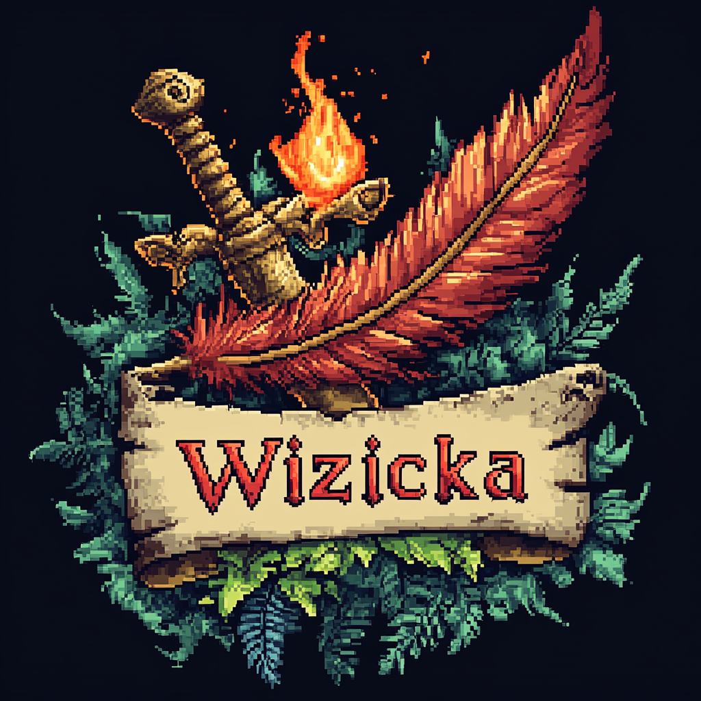
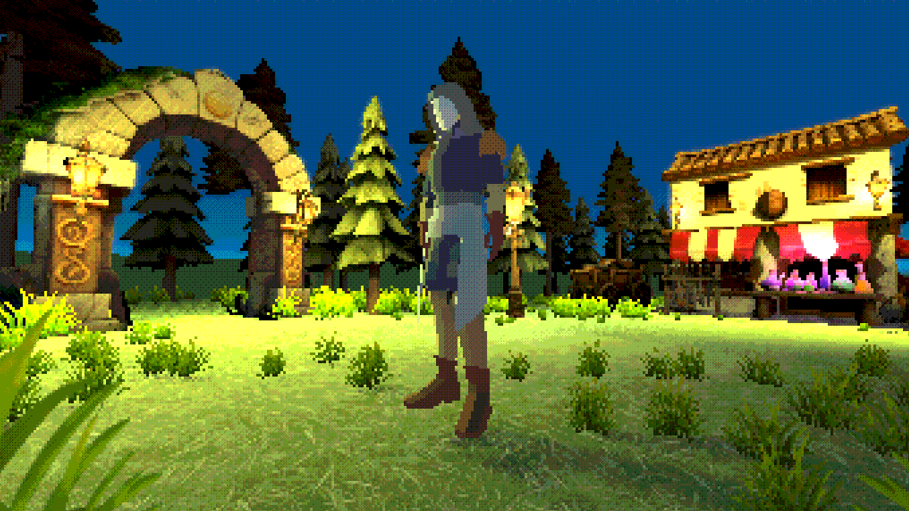
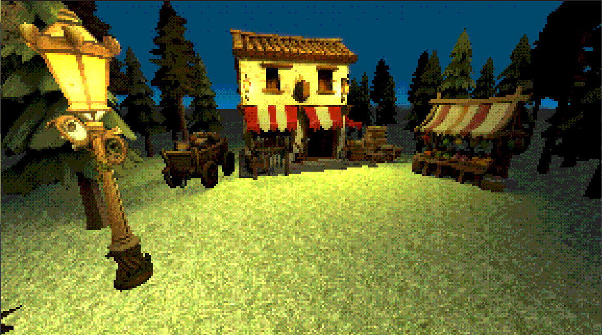
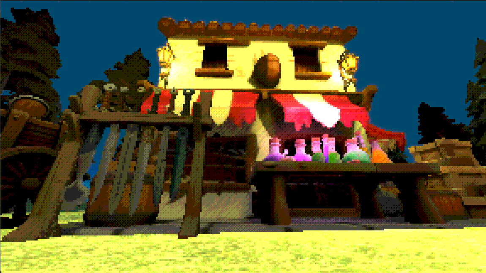

# 🧙‍♂️ Wizicka - A Magical Adventure ✨

Wizicka is a spellbinding adventure game built in **Godot 4.3**, where players harness the power of arcane magic to explore a mystical world, uncover secrets, and battle formidable foes. With an immersive environment, deep spell-casting mechanics, and a rich fantasy atmosphere, *Wizicka* is designed to captivate players with its engaging gameplay and fluid mechanics.

---



---
## 🌟 Features (Planned & Implemented)

🔲 **Spellcasting System** – Cast powerful elemental spells using a dynamic magic system.  
🔲 **Open World Exploration** – Traverse diverse landscapes filled with secrets and hidden paths.  
✅ **Physics-Based Interactions** – A world that reacts naturally to player actions.  
🔲 **AI-Driven Enemies** – Intelligent enemies with unique attack patterns and behaviors.  
✅ **Dynamic Camera System** – Smooth, responsive camera movement to enhance immersion.  
🔲 **Player Customization** – Unlock and equip different magical abilities.  
✅ **Procedural Terrain & Environments** – HALFWAY COMPLETE - Vast, varied landscapes dynamically generated.  
🔲 **Multiplayer Mode (Planned)** – Cooperative gameplay for magical duels or team-based challenges.  
🔲 **Rich Lore & Storytelling** – Uncover the mysteries of the world through NPCs, books, and artifacts.  

---

## 🔧 Technologies & Tools Used

- 🎮 **Engine**: Godot 4.3  
- 📜 **Scripting**: GDScript, Godot Shader Language (GDSL)  
- 🏞 **Graphics**: Godot’s Rendering Engine, Custom Shaders  
- 🎵 **Audio**: Godot’s Audio Engine  
- 💾 **Game Logic**: Custom scripts for terrain, camera, and game management  
- ⚡ **Physics**: Godot’s built-in physics system  

---

## 🚀 Installation & Running the Game

1. Clone the repository:
   ```sh
   git clone https://github.com/your-repo/wizicka.git
